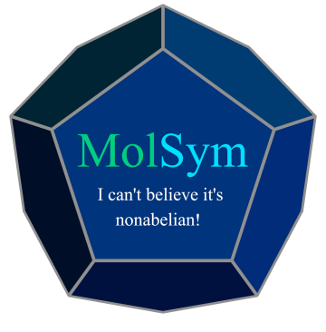

  

<table align="center">
  <tr>
    <th>Documentation</th>
    <th>CI</th>
    <th>Coverage</th>
  </tr>
  <tr>
    <td align="center">
      
    </td>
    <td align="center">
      
    </td>
    <td align="center">
       
    </td>
  </tr>
</table>

# MolSym
A python package for handling molecular symmetry.

## Capabilities
- Point group detection
- Symmetry element generation
- Character table generation
- SALC generation for atomic basis functions, internal coordinates, and cartesian coordinates

## Installing
As of now we do not have a better way to install the code other than cloning from GitHub.
Create a new conda environment with:

  `conda create -n "NameYourEnvironment" python=3.X`

MolSym is tested with Python 3.9-3.13, but should work for more recent versions and some older versions as well.
  
  `git clone git@github.com:NASymmetry/MolSym.git`

Install the necessary dependencies using `pip`.
  
  `pip install -r <Path to MolSym directory>/requirements.tx`

Alternatively, most Python environments come equipped with all but one dependency, so if `pip` is not desired, installing `QCElemental` is all that should be required.

  `conda install -c conda-forge qcelemental`

Finally append the MolSym directory to your `PYTHONPATH`.
  
 `export PYTHONPATH=$PYTHONPATH:<Path to MolSym directory>`
