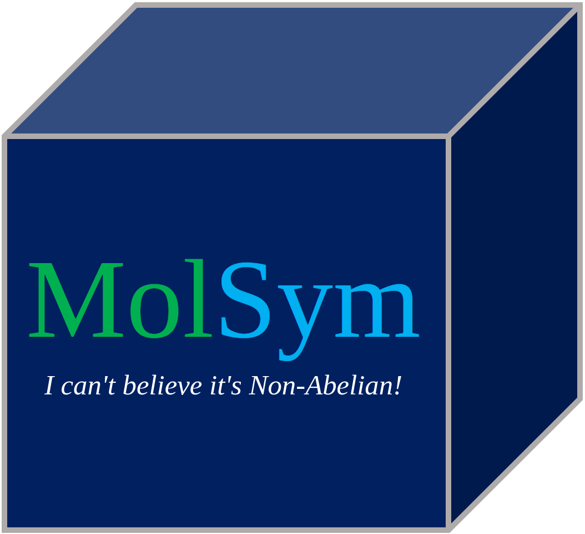

  

# MolSym
A python package for handling molecular symmetry!
<table align="center">
  <tr>
    <th>Documentation</th>
  </tr>
  <tr>
    <td align="center">
      <a href=https://FermiQC.github.io/Fermi.jl/dev>
      
      </a> 
    </td>
  </tr>
</table>

## Capabilities
- Point group detection
- Symmetry element generation
- Character table generation
- SALC generation for atomic basis functions, internal coordinates, and cartesian coordinates
