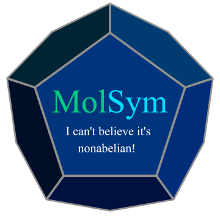

  

<table align="center">
  <tr>
    <th>Documentation</th>
    <th>CI</th>
    <th>Coverage</th>
    <th>Citation</th>
  </tr>
  <tr>
    <td align="center">
      
    </td>
    <td align="center">
      
    </td>
    <td align="center">
       
    </td>
     <td align="center">
      
    </td>
  </tr>
</table>

# MolSym
A python package for handling molecular symmetry.

## Capabilities
- [Point group detection](https://github.com/NASymmetry/MolSym/wiki/Point-group-detection)
- [Molecule symmetrization](https://github.com/NASymmetry/MolSym/wiki/Symmetrizing-a-molecule)
- Symmetry element generation
- Character table generation
- SALC generation for [atomic basis functions](https://github.com/NASymmetry/MolSym/wiki/SALCs#spherical-harmonics), [internal coordinates](https://github.com/NASymmetry/MolSym/wiki/SALCs#internal-coordinates), and [cartesian coordinates](https://github.com/NASymmetry/MolSym/wiki/SALCs#cartesian-coordinates)

## Installing
We recommend installing MolSym into its own environment. For example, with conda:

  `conda create -n "NameYourEnvironment" python=3.X`

  `conda activate "NameYourEnvironment"`

MolSym is available on [PyPI](https://pypi.org/project/molsym/) and can be installed with `pip`:

  `pip install molsym`

MolSym is also available on conda-forge and can be installed with `conda`:

  `conda install -c conda-forge molsym`

MolSym is tested with Python 3.10–3.14. Some features rely on the optional `QCElemental` dependency, which can be pulled in with:

  `pip install "molsym[qcel]"`

### Development installation
To work on MolSym itself, clone the repository and install it in editable mode:

  `git clone https://github.com/NASymmetry/MolSym.git # or git@github.com:NASymmetry/MolSym.git`

  `cd MolSym`

  `pip install -e .`

Include the optional `QCElemental`-backed features with:

  `pip install -e ".[qcel]"`
