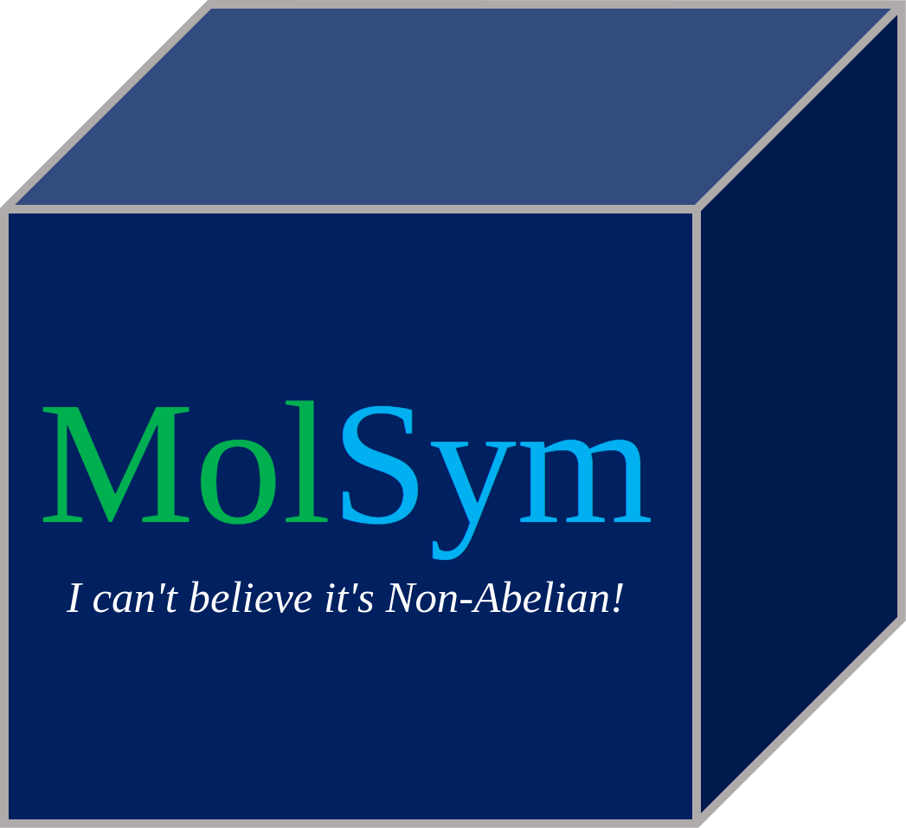

  

# MolSym
A python package for handling molecular symmetry.

## Capabilities
- Point group detection
- Symmetry element generation
- Character table generation
- SALC generation for atomic basis functions, internal coordinates, and cartesian coordinates
